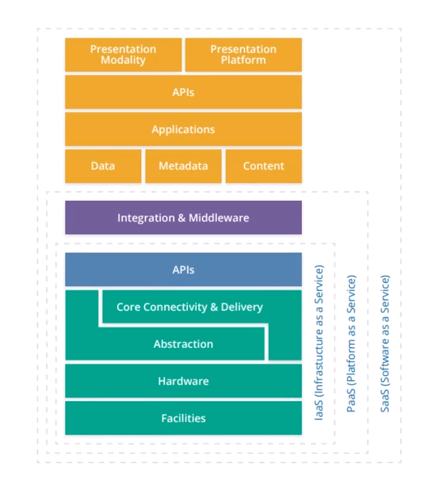
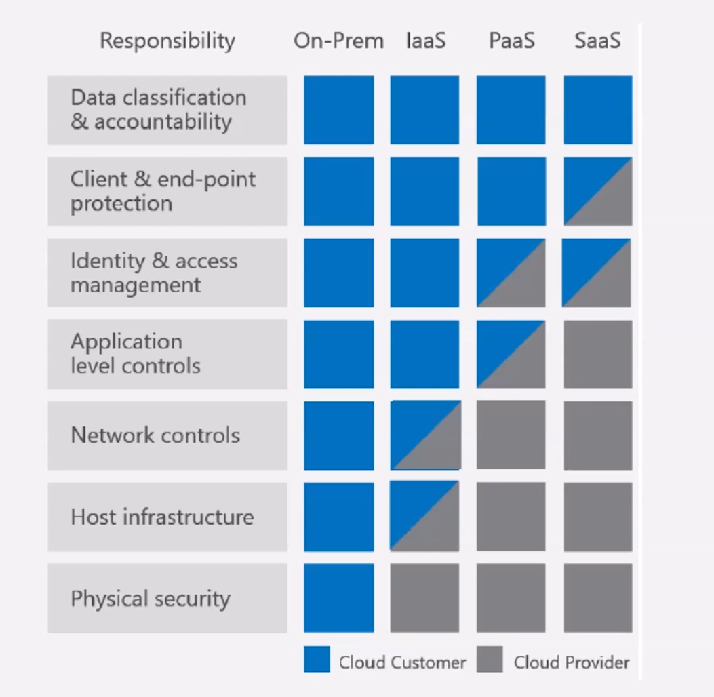
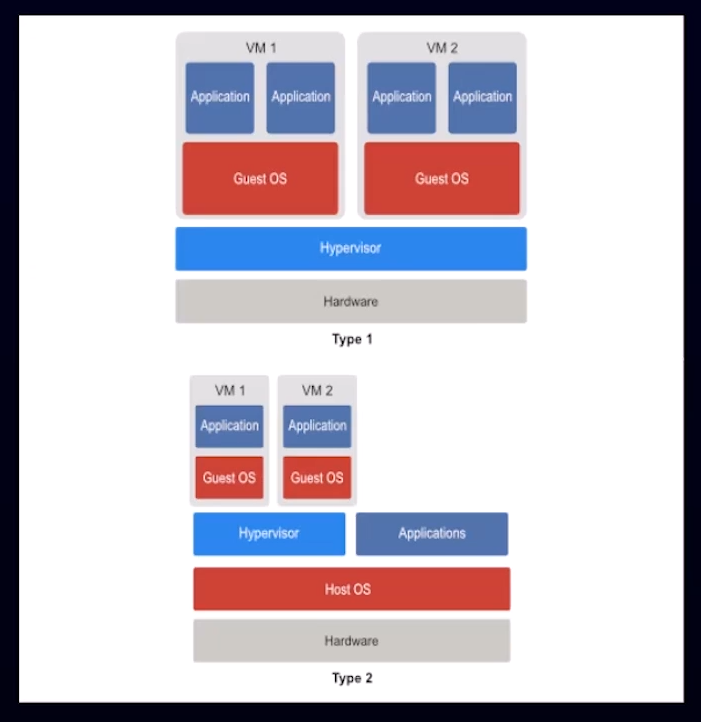

# Cloud platform and infrastructure security

**Domain 3 topics**

- Disaster recovery
- Cloud infrastructure
- Secure cloud data center
- Risks to cloud infrastructure
- Counter-measures
- Business continuity

**Module reflection**

- What cloud infrastructure are you responsible for protecting?

- How familiar are you with your organizations business continuity process?

- What is your disaster recovery process?

---

## Cloud infrastructure components

**Components**

**Shared responsibility model**

**Quiz Question**

Infrastructure security is the responsibility of the hosting provider?

- True
- False
- Mostly true, Correct

---

## The management plane

The management or control plane is really the central way that hardware, logical and network configurations are administered and deployed throughout the cloud environment (e.g. new hardware spin up, routing traffic, data flow)

**Management plane**

- Physical
- Logical
- Networking

**Control plane**

- How data moves

**Data or forwarding plane**

- Receive and forward traffic

there should be redundancy and strong access control when it comes to implementing and managing aspects through the management plane.

**Module reflection**

- How is access to your organization's management plane managed?

- How do you ensure that the management plane is configured correctly?

- How do you ensure that sufficient redundancy is in place?

---

## Administering middleware

Middleware is software that access a bridge between the OS or DB or applications especially on the network

Specially important to PaaS and SaaS

**Shared administration of middleware**

- Secure OS baseline
  - Difficulty patching images
  - in a cloud environment, in a VM the OS is on a file and can't be patched. You should ensure that whenever a virtual environment is activated there is a configuration check to ensure that it is up to date with the most appropriate security configurations and patches
- Secure application
  - Configuration templates
- Middleware
  - Version control
  - Change management
  - Third-party licenses

**Quiz Question**

Which of the following is not true about virtual images?

- Virtual images provide a solution for backing up customer OS and configurations
- Virtual images restoration needs to be test regularly to ensure that it worked
- Virtual images can be patched easily because the data is compressed, Correct

---

## Virtualization

The ability to create environments in the cloud that individual customers can utilize, take advantage of shared resources.

- Hypervisor hardening
  - logging & monitoring
  - updated & patched
  - Hypervisor (I & II)
    - I is more safe as each one of the virtual machines have their own OS
- Instance Isolation
  - logical isolation
    - for software and digital assets, is applied at the instance level. Each VM is logically protected from communicating with another VM
  - prevents data leakage and inter-vm attacks
  - Sandbox testing
- Host Isolation
  - Physical & logical isolation
  - Monitor for guest escape

**Hypervisor types 1 and 2**

**Quiz Question**

What type of attack is characterized by a user on a virtual instance attempting to elevate themselves to leave the VM and access the network?

- Guest escape, Correct
- Inter-VM attack
- Logical isolation

---

## Data access

The customer is always responsible for protecting the data in the theoretical and legal sense.

**Data access administration**

- Customer access administration
- Provider access administration
- Cloud access security broker (CASB)

**Module reflection**

- How many groups need access to your cloud environments?

- How could the administration of cloud data access at your organization been improved?

---

## Secure networking

**Maintaining a secure network**

- Virtual local area networks (VLAN)
  - a way of ensuring there is logical separation between VMs / networks on physical hardware
- Dynamic host configuration protocol (DHCP)
  - assigns an IP address to a device, enables routing, for a specific period of time so the IP can be re assigned
- Domain Name Service (DNS)
  - Configuration
  - Maintenance
  - DNS poisoning attack, attackers will change entries in the DNS table to disguise the origin of their attack
- Virtual private network (VPN)
  - encrypting tunnel between end points

**Quiz Question**

Which of the following is used to isolate network segments and prevents an attacker from moving through the network?

- DNS
- VLAN, Correct
- DHCP

---

## Network Security

**Cloud provider responsibility for network security**

- Protection
  - Firewall administration
- Detection
  - IDS (Intrusion detection system) /IPS (Intrusion prevention system)
  - Honeypot
    - intentionally setup to appear valuable or vulnerable systems that attract would-be attackers to investigate them. Honeypot registers the signature of the attacker and alerts the company.
- Communication protection
  - Virtual private network
  - Encryption
  - Strong authentication
- Improvement
  - Vulnerability assessments

**Quiz Question**

What is the key difference between IDS and IPS?

- An IDS uses analysis of behavior and an IPS uses a defined rule set

- An IDS actively closes port and services upon detection but and IPS prevent attackers from entering the network

- An IDS only reports suspicious activity and an IPS also takes defensive action, Correct

---

## System information and Event Management (SIEM)

**Security improvements of a SIEM:**

- Centralizes logging
- Enhanced analysis
- Dashboards and visualizations
- Automated response

Unless you have proper asset management to understand what needs to be monitored, it can be difficult to get values out of the SIEM.

That's why business impact analysis is critical for SIEM to function properly.

(e.g. anomalies logging of IP addresses outside the location employees working from)

**Quiz Question**

Which of the following is most important for effective SIEM operations?

- Asset management, Correct
- Alert optimization
- Incident response

---

## Cloud provider responsibility for physical plant

**Responsibilities include**

- Physical location
  - not in highly populated, or very remote (not many business and staff), political situation
- Secure and manage hardware components
- Log events and incidents
- Configure secure remote administrative access

**Quiz Question**

Which of the following dictates how processors can be used for cryptographic functions?

- Trusted Platform Module (TPM)
- Hardware controller
- Advanced Encryption Standard (AES)

---

## Power redundancy

**Physical environment**

- Availability
  - 99,999% up time, 6 minutes down time / yr
- Power
  - Data center and components
  - HVAC
  - Lighting
- Accidental power loss
- Conditioning
  - Uninterruptible power supply (UPS)

**Quiz Question**

How much unscheduled downtime is allowed by the five nines availability standard?

- 60 minutes
- 30 minutes
- 6 minutes, Correct

---

## Other redundancy and safety considerations

**Physical environment**

- American Society for Heating, Refrigeration, and Air-conditioning engineers (ASHRAE) standards

  - Temperature(64-80f, 18-27C)
  - Humidity(relative humidity 60%)

- Fire suppression
  - A - Ash
  - B - Boil
  - C - Current
  - D - Dilute

**Quiz Question**

A relative humidity of 60% in a data center lowers the risk of all the following except?

- Fire caused by static shock
- Corrosion
- Conditions not conductive to human health, Correct

---

## Data center tiers

right amount of availability, redundancy

ensure that maintains power, heating, cooling

**Tiers**

- Tier 1
  - 28.8 hours of down time
  - One source of power and cooling
  - Dedicated infrastructure 99.671% uptime
- Tier 2
  - 22.7
  - Redundant infrastructure 99.741% uptime
  - for medium size business
- Tier 3
  - 1.6hours
  - Fault-Tolerant 99.982% uptime (3 9s of uptime)
  - redundant backup power source for at least 72hrs
  - large companies
- Tier 4
  - 25 minutes
  - Fully Fault-Tolerant 99.995% uptime (4 5s of availability)
  - 96hrs power source
  - national business etc

**Quiz Question**

You are a cloud consultant helping a business determine the appropriate data center tier for their needs. This is a small business but it needs at least 99.5% availability. Which of the following is the minimum appropriate data center tier for these requirements?

- Tier 4
- Tier 3
- Tier 1, Correct

---

## Cloud threats I

- External threats
  - Denial of service or DDos
  - brute force attacks
  - MINM attacks (attacker trying to compromise the integrity of information in transit, modify or collect)
- Insider threats
  - important in the public cloud, where changing configurations can affect thousands of customers
  - Escalation of privilege, employees can intentionally increase their privileges to execute services/applications or third parties
- Stolen/Lost devices
  - protect the physical devices to access the cloud
- Malware
  - list impactful in SaaS
- Natural disasters
  - location

**Module reflection**

- Which threats are most applicable to your organization?
- How would you address these threats?

---

## Cloud threats II

- Physical control
  - can't evaluate the security of the assets and data
- Audit
  - can't really audit all the controls, some trust needed in third party audit reports that are used to evaluate if the provider is honoring their obligations
- Policy control
- Regulatory violations
- Contractual failure
  - Vendor lock-in, lock-out

**Module reflection**

- Which threats are most applicable to your organization?
- How would you address these threats?
- Which of these threats surprised you?

---

## Protecting against cloud threats I

**External threats**

- limiting the attack surface by hardening the infrastructure, the hypervisor and any VMs, check configuration baseline that are up to date at startup
- effective monitoring on the sensitive data
- train employees for suspicious activity, and define incident report process that drilled frequently

**Insider threats**

- before individual hired and after, extensive background check especially if they have access to sensitive information and test their skills
- well trained in the particular cloud environment, skills kept up to date, misconfigurations can result in the accidental disclosure of data or open vulnerabilities
- jobs are rotated, so one individual doesn't have complete control over a particular area
- employee data masking, data should be available to people based on their need to know

**Stolen/Lost devices**

- encrypt any endpoints - laptops or workstations
- disable or destroy any usb
- laptops have remote wiping capability

**Malware**

more impact in PaaS and SaaS

- install anti malware agents
- regular patching (difficult because it should be tested)
- awareness for phishing campaigns
- SIEM solution

**Natural disasters**

- redundant sources
- backups in different regions, unaffected by the same natural disaster

**Module reflection**

- Which controls were unfamiliar to you?
- Did you hear about any controls that should be implemented at your organization?

---

## Protecting against cloud threats II

controls against cloud threats that result from lack of direct control

- not allowed access locations or audits, review reports, strong contractual language that enforces penalties for the hosting provider
- hire knowledge people, train employees
- sensitive data is encrypting
- obfuscation techniques to prevent accidental disclosure
- restrict access

**Module reflection**

- Which controls had you not considered?
- Reconsider the impact of legal, compliance, and policy controls in the cloud

---

## Shared responsibility for cloud platform oversight

**Customer and provider coordination**

key areas:

- Testing
- Incident investigation and response
- Data loss prevention (DLP)

**Quiz Question**

Why should too much access to cloud provider data, logs, or environment be concerning to a cloud customer?

- The amount of data could overwhelm the customer's system
- The customer may not be able to effectively test because of difficulty prioritizing data elements
- If the provider allows generous access to one customer, it may be doing the same with other customers and making the platform less secure, Correct

---

## Cloud-based business continuity and disaster recovery

**Business Continuity vs. Disaster Recovery**

Disaster recovery has a more technical nuance, it is the recovery of the technical systems, which may be a prerequisite for business continuity

Business continuity is all encompassing, focusing on all the enterprise risk management aspects, people, restoring the business

key factors:

- Human safety is the first priority, in both
  - food, water, rations
- Plan
  - comes from business impact, in design define which are the critical aspects which need to be restored first, restored in priority
- Communication equipment
  - alternate form of communication, walkie talkie
- Network artifacts
- Software copies
  - backups for critical systems
- Documentation

**Quiz Question**

What is second priority in business continuity and disaster recovery?

- System protection, Correct
- Human safety
- Getting outside help

---

## Disaster declaration

creating specific criteria for either operational metrics or availability metrics that are used to declare disasters can help expedite the process and create clarity about when a disaster recovery scenario needs to be declared and implemented.

**Disaster recovery**

Disaster recovery priorities:

- Critical asset inventory
- Event declaration criteria
- Disaster recovery roles
  - who is responsible of declaring and coordinating

**Module reflection**

- How is the disaster recovery process initiated in your organization?

- How familiar are you with the disaster recovery process?

- What business continuity situations has your organization considered?

---

## Disaster recovery criteria

Disaster recovery metrics:

- Maximum allowable downtime (MAD)
  - the amount of time, interruption of service, that basically ends your business
- Recovery time objective (RTO)
  - capabilities of critical functions have to be up and established
- Recovery point objective (RPO)
  - goal of limiting the loss of data
  - the time measuring the loss of data
  - the amount of data the organization can lose without compromising the business operations
- Annual loss expectancy (ALE)
  - combination of 2 metrics
  - measurers the amount of time a organization is expecting to lose on annual basis, because of certain a disaster recovery scenario or risk
  - annual rate of occurrence (likelihood in a year) & single loss expectancy (what's the cost)
  - probability of a catastrofic event happening in a given year

**Quiz Question**

Which metric reflects the organization's goal for limiting data lost during disaster recovery?

- Maximum allowable downtime (MAD)
- Recovery point objective (RPO), Correct
- Recovery time objective (RTO)

---

## Disaster recovery testing

**Testing method in order of intensity**:

- Tabletop test
  - procedures and artifacts used for Disaster Recovery, mock drill
- Dry run
  - more intensive, using a call tree to contact all the people that need to notified
  - impacts productivity
  - check if work in practice
- Full test
  - most intense
  - entire organization
  - failover in another geographic region
  - are backups completed properly

**Quiz Question**

Which of the following is the most useful for detecting shortcoming in disaster recovery plans?

- Tabletop testing
- Dry run
- Full test, Correct

---

## Domain 3 Summary

**Cloud platform and infrastructure security**

- Cloud infrastructure
- Secure cloud data center
- Risks to cloud infrastructure
- Counter-measures
- Business continuity
- Disaster recovery

**Module reflection**

- What cloud infrastructure are you responsible for protecting?

- How familiar are you with your organization's business continuity process?

- What is your disaster recovery process?

---
